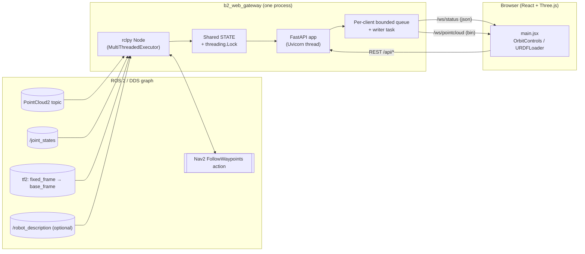

# B2 Web RViz

เว็บแอปแบบ RViz บน Tablet/Browser สำหรับ Unitree B2 + ROS 2 Humble  
โฟลว์: **ROS 2 / DDS** → **gateway node (FastAPI + WebSocket)** → **React + Three.js**

## ความสามารถ

- สตรีม **PointCloud2** (binary WebSocket) — gateway แปลงเมฆเข้า **`fixed_frame`** ผ่าน TF ได้ (ถ้า TF พร้อม)
- **TF** `fixed_frame → base_frame` → ตำแหน่งหุ่นใน 3D
- **URDF + mesh** — ค่าเริ่มต้นโหลดจาก **`b2_web_rviz` เอง** (`bundled_ros2_b2_unitree_description/` ในแพ็กเกจ) ไม่ subscribe `/robot_description`; ถ้าต้องการพึ่ง `robot_state_publisher` ให้ตั้ง `use_bundled_b2_urdf:=false`
- **มุมมอง Top / 3D**, OrbitControls — ซูม / หมุน / pan (ทัชและเมาส์)
- **Waypoint หลายจุด** — คลิกแล้วลากกำหนด yaw (ใช้ได้ทั้ง Top และ 3D บนพื้น Z=0)
- **Nav2 `FollowWaypoints`** — Start / Cancel / Repeat หลายรอบ (`-1` = วนจนกด Cancel)
- **Backpressure-safe WS** — ทั้ง `/ws/status` และ `/ws/pointcloud` มี bounded queue ต่อ client (drop-oldest) ป้องกันสะสมหน่วงเมื่อเครือข่ายช้า
- **Live params** — ปรับ `pointcloud_*`, `transform_pointcloud`, `pointcloud_in_robot_frame`, `pointcloud_tf_time`, `max_points` ได้ขณะรันด้วย `ros2 param set …`
- **URDF reload signal** — เมื่อ URDF เปลี่ยน gateway ส่ง `urdf_version` ใหม่ทาง `/ws/status` แล้วเบราว์เซอร์โหลดซ้ำให้อัตโนมัติ
- **HMI Dashboard ที่ root `/`** — server-rendered HTML ปุ่ม Start/Stop/Show log สไตล์ HMI สำหรับ ROS launches (whitelist `manifest`); หน้า `/app/` คือ RViz 3D ปกติ — มีลิงก์ `≡ Dashboard` ใน toolbar ของ RViz กลับมาที่หน้านี้

---

## สถาปัตยกรรม



### ROS interfaces

| ทิศทาง | Topic / Service / Action | Type | QoS |
|--------|---------------------------|------|-----|
| Subscribe | `pointcloud_topic` (default `/rslidar_points_aligned`) | `sensor_msgs/PointCloud2` | sensor_data (best-effort, depth=5) |
| Subscribe | `joint_states_topic` (default `/joint_states`) | `sensor_msgs/JointState` | sensor_data |
| Subscribe | `/robot_description` (เฉพาะเมื่อ `use_bundled_b2_urdf:=false`) | `std_msgs/String` | transient_local + reliable (latched) |
| Subscribe | `plan_topic` (default `/plan`) | `nav_msgs/Path` | reliable + volatile (matches Nav2 default) |
| TF buffer | `fixed_frame → base_frame` | `tf2` | default |
| Service client | `<robot_description_node>/get_parameters` | `rcl_interfaces/GetParameters` | service default |
| Action client | `follow_waypoints_action` (default `/follow_waypoints`) | `nav2_msgs/FollowWaypoints` | action default |

### HTTP / WebSocket endpoints

| Method / Path | ใช้ทำอะไร |
|----|----|
| `GET /api/status` | snapshot ของ pose, joint_positions, nav_feedback, waypoints, urdf_version, urdf_etag |
| `GET /api/config` | snapshot พารามิเตอร์ของโหนด + รายชื่อคีย์ที่ POST แก้ได้ (`editable`) |
| `POST /api/config` | UI ปรับ live params; whitelist เฉพาะคีย์ใน `editable` — ทำงานผ่าน `set_parameters` + `on_set_parameters_callback` |
| `GET /api/robot_description` | URDF (JSON envelope; ส่ง `Accept: application/xml` หรือ `?format=xml` เพื่อรับ XML ดิบ) — ตอบ `ETag` + `X-URDF-Version` รองรับ `If-None-Match` คืน 304 |
| `GET /api/pkg/{pkg}/{path}` | mesh / texture จาก `package://` (พิจารณาจาก asset cache ก่อนเสมอ; ส่ง `Cache-Control: max-age=3600`) |
| `POST /api/waypoints` | บันทึก waypoint list ปัจจุบัน |
| `POST /api/navigation/start` | ส่ง `FollowWaypoints` พร้อม `repeat_count` |
| `POST /api/navigation/cancel` | ขอยกเลิก goal ปัจจุบัน |
| `GET /api/processes` | สถานะ ROS processes ที่ launcher ดูแล (ชื่อ, cmd, running, pid, log_tail) |
| `POST /api/processes/{name}/start` | เริ่ม process ที่อยู่ใน manifest (whitelist) |
| `POST /api/processes/{name}/stop` | ส่ง SIGINT → SIGTERM → SIGKILL ตามลำดับ |
| `GET /api/processes/{name}/log?tail=N` | ดึง log ย้อนหลัง (สูงสุด 500 ใน buffer) |
| `WS  /ws/status` | สตรีม pose + joint_positions + nav_feedback + urdf_version + nav_plan (queue 8, drop-oldest) |
| `WS  /ws/pointcloud` | binary frames: 1 บรรทัดแรก JSON header, ที่เหลือ Float32 xyz (queue 2, drop-oldest) |

---

## โครงสร้างใน workspace

```text
b2_web_rviz_ws/
  backend/b2_web_rviz/
    bundled_ros2_b2_unitree_description/   ← URDF + meshes (ติดตั้งไป share/b2_web_rviz/…)
  frontend/
```

### อัปเดตแบบจำลอง B2 ที่แพ็กมากับ gateway

แหล่งต้นฉบับใน workspace (ตัวอย่าง):

`/home/fibo/unitree_ros2/cyclonedds_ws/src/ros2_b2_unitree_description`

คัดลอกเข้าแพ็กเกจแล้ว build ใหม่:

```bash
SRC=/home/fibo/unitree_ros2/cyclonedds_ws/src/ros2_b2_unitree_description
DST=.../b2_web_rviz_ws/backend/b2_web_rviz/bundled_ros2_b2_unitree_description
rm -rf "$DST" && mkdir -p "$DST" && cp -a "$SRC/urdf" "$SRC/meshes" "$DST/"
colcon build --packages-select b2_web_rviz --paths .../backend/b2_web_rviz
```

Build backend จาก root ของ `cyclonedds_ws`:

```bash
cd ~/unitree_ros2/cyclonedds_ws
source /opt/ros/humble/setup.bash
colcon build --packages-select b2_web_rviz \
  --paths src/ros2_general_purpose_slam_and_navigation/b2_web_rviz_ws/backend/b2_web_rviz
source install/setup.bash
```

---

## รันพร้อม FAST-LIO Nav2 (frame `odom_sync`)

**เทอร์มินัล 1 — Nav2 + LiDAR (ตัวอย่างจากโปรเจกต์ของคุณ)**

```bash
ros2 launch fastlio2_mapping fastlio_nav2_odom.launch.py pub_vel_bridge:=false zone_walk_lock:=false
```

**เทอร์มินัล 2 — (ทางเลือก) `robot_state_publisher` / joint GUI — สำหรับ TF ข้อต่อบน ROS**

ถ้าใช้ **`use_bundled_b2_urdf:=true`** (ค่าเริ่มต้น) UI ไม่ต้องมี `/robot_description` จากที่นี่ — แต่ถ้าระบบของคุณต้องการ **`robot_state_publisher`** เพื่อโครง TF เดียวกับจริง ให้รัน launch ของคุณตามเดิม

เดิมทีตัวอย่าง:

```bash
ros2 launch ros2_b2_unitree_description display_b2.launch.py
```

**เทอร์มินัล 3 — Gateway**

ค่าเริ่มต้นถูกตั้งให้ตรงกับ FAST-LIO Nav2 (`fixed_frame=odom_sync`, `base_frame=base_footprint_sync`, `pointcloud_topic=/cloud_registered`, `pointcloud_in_robot_frame=false`):

```bash
source ~/unitree_ros2/cyclonedds_ws/install/setup.bash
ros2 launch b2_web_rviz b2_web_gateway.launch.py
```

หรือเรียกตรงๆ:

```bash
ros2 run b2_web_rviz b2_web_gateway
```

ถ้าจะให้เมฆแนบกับหุ่น (FAST-LIO body cloud):

```bash
ros2 run b2_web_rviz b2_web_gateway --ros-args \
  -p pointcloud_topic:=/cloud_registered_body \
  -p pointcloud_in_robot_frame:=true
```

เปิด UI หลัก (โหลดจากแพ็กเกจ — **ไม่ต้องรัน npm** ถ้า build ครบแล้ว):

- **`http://<robot-ip>:8080/`** — หน้าแรก + ปุ่มไป UI  
- **`http://<robot-ip>:8080/app/`** — หน้า 3D / waypoint / point cloud (ชี้ API + WebSocket ไปที่พอร์ตเดียวกันอัตโนมัติ)

ถ้า `/app/` ขึ้น 404 ให้สร้าง static แล้ว build แพ็กเกจใหม่:

```bash
cd ~/unitree_ros2/cyclonedds_ws/src/ros2_general_purpose_slam_and_navigation/b2_web_rviz_ws/frontend
npm ci   # หรือ npm install
npm run build
rm -rf ../backend/b2_web_rviz/www && mkdir -p ../backend/b2_web_rviz/www && cp -r dist/* ../backend/b2_web_rviz/www/
cd ~/unitree_ros2/cyclonedds_ws
colcon build --packages-select b2_web_rviz \
  --paths src/ros2_general_purpose_slam_and_navigation/b2_web_rviz_ws/backend/b2_web_rviz
```

**ทางเลือก — Dev แยกพอร์ต (hot reload):**

```bash
cd ~/unitree_ros2/cyclonedds_ws/src/ros2_general_purpose_slam_and_navigation/b2_web_rviz_ws/frontend
npm install   # ครั้งแรก
npm run dev -- --host 0.0.0.0 --port 5173
```

แล้วเปิด `http://<robot-ip>:5173` (ชี้ backend ไป `:8080` ตามค่าเริ่มต้นของ UI)

Production เดิม (แยกพอร์ต):

```bash
cd frontend && npm run build && npx vite preview --host 0.0.0.0 --port 5173
```

---

## Dependencies (Ubuntu / Humble)

```bash
sudo apt update
sudo apt install -y \
  ros-humble-nav2-msgs \
  python3-fastapi \
  python3-uvicorn \
  python3-numpy
```

Python package ใช้ `ament_index_python` (ระบุใน `package.xml`)

---

## Nav2

ต้องมี action server:

```bash
ros2 action list | grep follow_waypoints
```

ค่าเริ่มต้น: `/follow_waypoints` — เปลี่ยนได้ด้วย launch arg `follow_waypoints_action:=...`

---

## Zenoh / DDS

Gateway ไม่ผูก Zenoh โดยตรง — รันในเครื่องที่ **`ros2 topic` / `ros2 action`** เห็น Nav2 + TF + point cloud เหมือนปกติ  
ถ้าใช้ `zenoh-bridge-dds` หรือ `rmw_zenoh` ให้ bridge จนฝั่ง ROS graph ครบ แล้วค่อยรัน gateway

---

## พารามิเตอร์สำคัญของ gateway

| พารามิเตอร์ | ค่าเริ่มต้น | หมายเหตุ |
|-------------|-------------|----------|
| `pointcloud_topic` | `/cloud_registered` | FAST-LIO world-fixed cloud (ใช้ TF) — ตั้ง `/cloud_registered_body` คู่กับ `pointcloud_in_robot_frame:=true` ได้ |
| `fixed_frame` | `odom_sync` | TF fixed frame ของฉาก |
| `base_frame` | `base_footprint_sync` | TF base ของหุ่น |
| `transform_pointcloud` | `true` | แปลงเมฆเข้า fixed_frame |
| `max_points` | 80000 | จำกัดจุดส่งเว็บ |
| `robot_description_node` | `robot_state_publisher` | ดึง URDF จากพารามิเตอร์ |
| `frontend_dist` | `""` | path ไปยังโฟลเดอร์ `dist` ของ Vite (ว่าง = ใช้ `share/b2_web_rviz/www`) |
| `pointcloud_tf_time` | `latest` | `latest` = ใช้ TF ล่าสุด (ลดเมฆหมุนมั่วเมื่อ stamp ไม่ตรง) · `message_stamp` = ใช้เวลาบนข้อความเมฆ |
| `pointcloud_in_robot_frame` | `false` | `true` = ไม่แปลงเมฆเข้า fixed frame; ส่ง `in_robot_frame` ให้ UI แนบเมฆกับหุ่น (เหมาะ `/cloud_registered_body`) |
| `joint_states_topic` | `/joint_states` | ใช้ขับมุมข้อต่อ URDF ในเบราว์เซอร์ — **ชื่อ joint ต้องตรงกับ URDF** |
| `subscribe_joint_states` | `true` | ตั้ง `false` เพื่อไม่สมัครรับ JointState |
| `use_bundled_b2_urdf` | `true` | `true` = โหลด `b2.urdf` + mesh จาก **`share/b2_web_rviz/bundled_ros2_b2_unitree_description/`** ไม่ subscribe `/robot_description` · `false` = โหมดเดิม (ท็อปปิก + GetParameters) |
| `cache_urdf_assets` | `true` | เมื่อได้ URDF ใหม่ จะ **คัดลอกไฟล์ `package://…` (mesh ฯลฯ)** ไปเก็บใน `asset_cache_dir` และ `/api/pkg/…` อ่านจากแคชก่อน |
| `asset_cache_dir` | *(ว่าง)* | ถ้าว่างใช้ **`~/.cache/b2_web_rviz/package_assets`** — โครงสร้างใต้นั้นคือ `<ชื่อแพ็กเกจ>/<path ใน share>/…` |
| `status_rate_hz` | 10.0 | อัตราส่ง `/ws/status` (ลด CPU/แบนด์วิดท์ฝั่ง tablet ได้ด้วยการตั้ง `5.0`) |
| `pointcloud_rate_hz` | 5.0 | จำกัดอัตราส่ง `/ws/pointcloud` |
| `pointcloud_range_limit` | 40.0 | คัดจุดในรัศมี XY (เมตร) |
| `pointcloud_z_min`, `pointcloud_z_max` | -3.0 / 3.0 | กรองตามแกน Z (เมตร) |
| `robot_description_max_attempts` | 60 | จำนวนครั้งที่ลองเรียก `GetParameters` ก่อนยอม (เฉพาะโหมด `use_bundled_b2_urdf:=false`) |
| `plan_topic` | `/plan` | `nav_msgs/Path` ที่ Nav2 planner publish — UI วาดเป็นเส้น cyan |
| `plan_rate_hz` | 5.0 | จำกัดอัตรา repaint plan เข้า browser |
| `plan_max_points` | 2000 | จำกัดจำนวนจุดใน path (downsample ด้วย stride; ปลายทางสุดท้ายถูกเก็บเสมอ) |
| `plan_stale_seconds` | 30.0 | ลบ plan ออกถ้านิ่งเกินกี่วินาที (ตั้ง 0 = ไม่หมดอายุ) |

> พารามิเตอร์ในกลุ่ม `pointcloud_rate_hz`, `pointcloud_range_limit`, `pointcloud_z_min/max`, `max_points`, `transform_pointcloud`, `pointcloud_in_robot_frame`, `pointcloud_tf_time` รองรับการปรับ **ระหว่างรัน** ผ่าน:
> 1. **Web UI** — section *Stream settings* ในแผงด้านขวา (ส่งค่าแบบ debounced 0.25s ไปยัง `POST /api/config`)
> 2. **CLI** — `ros2 param set /b2_web_gateway <name> <value>`
>
> ทั้งสองทางเรียก `on_set_parameters_callback` ตัวเดียวกันที่ validate แล้วเก็บค่าลง state ของ node — มีผลทันทีในเฟรม pointcloud ถัดไปโดยไม่ต้องรีสตาร์ท ส่วน `pointcloud_topic`, `fixed_frame`, `base_frame`, `joint_states_topic`, `status_rate_hz`, `use_bundled_b2_urdf` ยังต้องรีสตาร์ทเพราะผูกกับ subscription / timer

ข้อความ URDF ที่ส่งให้เว็บมาจาก **ไฟล์ในแพ็กเกจ** (โหมด bundled) หรือจาก `/robot_description` + พารามิเตอร์ (โหมดเก่า) — mesh ในโหมด bundled ถูก remap เป็น `package://b2_web_rviz/bundled_ros2_b2_unitree_description/…`

---

## แก้ปัญหา (URDF ไม่ขึ้น / เมฆหมุนมั่ว)

**URDF ขึ้น OK แต่ไม่เห็นหุ่น** — mesh `.dae` โหลดแบบ async; ดูสถานะ `OK (N meshes)` ถ้า N=0 เปิด DevTools → Network ว่า `/api/pkg/.../*.dae` โหลดหรือไม่  
ฉากเป็น XY พื้น / Z ขึ้นเหมือน ROS; URDF ไม่ถูกหมุนเพิ่ม — ถ้าโมเดลบางตัวเป็น Y-up จาก exporter ให้ใส่การหมุนใน `frontend/src/main.jsx` หลัง `loader.parse(xml)` ตามต้องการ

**เมฆ `/cloud_registered_body` หมุนมั่ว** — ค่าเริ่มต้นใช้ **`pointcloud_tf_time:=latest`** แล้ว  
ถ้ายังไม่ดี ให้ลองแนบเมฆกับหุ่น (ไม่พึ่ง TF fixed frame):

```bash
ros2 run b2_web_rviz b2_web_gateway --ros-args \
  -p pointcloud_topic:=/cloud_registered_body \
  -p pointcloud_in_robot_frame:=true
```

(หรือใส่พารามิเตอร์เดียวกันใน launch)

---

## HMI Dashboard ที่ `/` (run ROS launches จากเบราว์เซอร์)

หน้า `http://<host>:8080/` คือ HMI dashboard — server-rendered HTML ที่มาพร้อมปุ่ม **Start / Stop / Show log** สำหรับแต่ละ ROS process ใน manifest โหลดได้แม้ frontend SPA ยังไม่ build หน้า dashboard มี:

- การ์ดละ 1 process — channel code (P01, P02, …) + ชื่อ + คำสั่งเต็ม + badge `RUNNING / STOPPED / EXITED`
- ปุ่ม **Show log** เปิด log viewer ที่อัปเดตทุก 2 วินาที (ดึงจาก `/api/processes/{name}/log?tail=80`)
- **Start all / Stop all / Refresh** ที่ batch control
- ลิงก์ **Open 3D RViz UI →** ไปยัง `/app/` (เปิด tab ใหม่)

หน้า `/app/` คือ RViz 3D — toolbar มีลิงก์ `≡ Dashboard` กลับมาหน้า dashboard ได้ตลอด

### Default manifest

```json
{
  "nav2_odom":         "ros2 launch fastlio2_mapping fastlio_nav2_odom.launch.py pub_vel_bridge:=false zone_walk_lock:=false",
  "robot_description": "ros2 launch ros2_b2_unitree_description display_b2_joints_pub_gui.launch.py",
  "joint_state_pub":   "ros2 run ros2_unitree_api_client sensers_unitree_go_joint_state_publisher"
}
```

### Override ด้วย JSON

ทำไฟล์ของตัวเอง (เพิ่ม / ลบ / เปลี่ยนคำสั่งได้ตามต้องการ — UI จะเรียกได้เฉพาะชื่อใน manifest เท่านั้น) แล้วชี้ผ่านพารามิเตอร์:

```bash
cat > ~/b2_processes.json << 'EOF'
{
  "nav2_odom":         "ros2 launch fastlio2_mapping fastlio_nav2_odom.launch.py pub_vel_bridge:=false",
  "rviz":              "ros2 run rviz2 rviz2"
}
EOF

ros2 run b2_web_rviz b2_web_gateway --ros-args -p process_manifest_file:=$HOME/b2_processes.json
```

### พฤติกรรมการ stop / shutdown

- กดปุ่ม **Stop** บน UI → backend ส่ง `SIGINT` ก่อน (เหมือน Ctrl+C) รอ 5s ถ้ายังไม่ตายส่ง `SIGTERM` รอ 2s แล้วค่อย `SIGKILL`
- ปิด `b2_web_gateway` (Ctrl+C) → lifespan stop ทุก process ที่ยัง running ก่อนปิด uvicorn
- แต่ละ child ถูกใส่ใน *new session* (`start_new_session=True`) — `killpg` จึงเก็บ launch tree ของ Nav2 ทั้งกอ ไม่หลงเหลือ orphan
- log buffer ขนาด 500 บรรทัด/process เก็บไว้ใน RAM (ปรับด้วย `process_log_buffer`)

### Security note

UI **ไม่ส่ง shell ดิบ** มาที่ backend — ส่งได้แค่ "ชื่อ" ที่ตรงกับ manifest เท่านั้น เพราะฉะนั้น attack surface คือ "ใครก็ตามใน LAN เดียวกันสตาร์ท/หยุด launch ที่คุณไม่ได้ตั้งใจได้" — ถ้ารันบนเครือข่ายไม่น่าเชื่อถือ บล็อกพอร์ต 8080 ก่อน (ufw / iptables)

---

## Known limitations

- PointCloud decoder รองรับฟิลด์ `x,y,z` แบบ **FLOAT32 / FLOAT64**; datatype อื่นจะถูกข้ามและมี warning (rate-limit ทุก 5 วินาที)
- JointState → URDF ใช้เฉพาะฟิลด์ `position` (เรเดียนสำหรับ revolute / เมตรสำหรับ prismatic); floating/planar ใน urdf-loader ยังไม่ครบ
- ถ้าข้อต่อไม่ขยับ ให้ตรวจ `ros2 topic echo /joint_states --once` และ QoS ว่าตรงกับ publisher (มักใช้ best effort คู่กับ `joint_state_publisher`)
- ไม่มี HTTPS / auth — ใช้ใน LAN / VPN ที่ไว้ใจได้

## Tests

มี pytest สำหรับฟังก์ชันบริสุทธิ์ใน gateway (ไม่ต้องรัน ROS):

```bash
cd ~/unitree_ros2/cyclonedds_ws/src/ros2_general_purpose_slam_and_navigation/b2_web_rviz_ws/backend/b2_web_rviz
python3 -m pytest -p no:anyio test/test_pure_utils.py -q
```

ครอบคลุม `_param_bool`, path normalization, `package://` URI extraction, quaternion roundtrip + matrix sanity

---

## เชื่อมกับสคริปต์ launcher (Python dict)

ตัวอย่างคำสั่งเพิ่ม:

```python
"b2_web_gateway": "ros2 launch b2_web_rviz b2_web_gateway.launch.py",
"b2_web_rviz_ui": (
    "bash -lc 'cd .../b2_web_rviz_ws/frontend && npm run dev -- --host 0.0.0.0'"
),
```

แทน `...` เป็น path เต็มในเครื่องคุณ — defaults ของ launch ตรงกับ FAST-LIO Nav2 อยู่แล้ว ไม่ต้องส่ง argument เพิ่ม


# Terminal เดียวพอ
source ~/unitree_ros2/setup_local.sh

ros2 run b2_web_rviz b2_web_gateway --ros-args \
  -p fixed_frame:=odom_sync \
  -p base_frame:=base_footprint_sync \
  -p pointcloud_topic:=/cloud_registered_body \
  -p pointcloud_in_robot_frame:=true


# Install
```bash
# --- frontend ---
cd ~/unitree_ros2/cyclonedds_ws/src/ros2_general_purpose_slam_and_navigation/b2_web_rviz_ws/frontend
npm ci || npm install
npm run build
rm -rf ../backend/b2_web_rviz/www && mkdir -p ../backend/b2_web_rviz/www && cp -r dist/* ../backend/b2_web_rviz/www/

# --- ROS package ---
source /opt/ros/humble/setup.bash
cd ~/unitree_ros2/cyclonedds_ws
colcon build --packages-select b2_web_rviz \
  --paths src/ros2_general_purpose_slam_and_navigation/b2_web_rviz_ws/backend/b2_web_rviz
source install/setup.bash
ros2 run b2_web_rviz b2_web_gateway
```